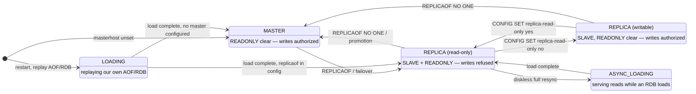
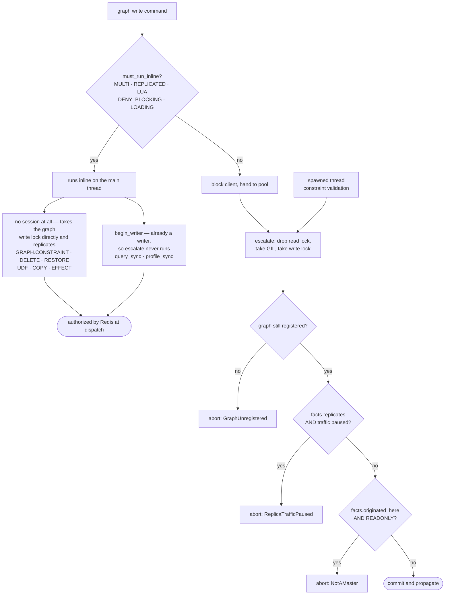
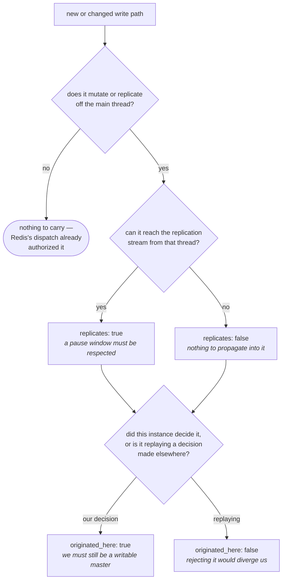

# Write authorization

Which graph writes are re-checked against live server state before they commit, and
which are not — and why every case is covered.

## The invariant

Redis asserts that a command may not propagate while the server is paused for a
failover, or after it has become a replica:

```
server.c  ==> '!(isPausedActions(PAUSE_ACTION_REPLICA) && !server.client_pause_in_transaction)'
```

It is an assert rather than an error return because by the time it fires the write is
already applied: there is nothing to roll back, and letting it into the replication
stream breaks the guarantee a failover is predicated on.

Ordinary Redis commands satisfy this for free, because **admit → apply → propagate is
one uninterrupted turn on the main thread**. FalkorDB breaks that atomicity: a write is
admitted on the main thread but mutates and propagates later, from a worker. Anything in
that gap — a `CLIENT PAUSE`, a `FAILOVER`, a demotion — invalidates the admission-time
decision. So the check has to be made again, immediately before the commit.

## Two independent axes

Authorization is decided by two questions that are easy to conflate:

| axis | question | answered by |
| --- | --- | --- |
| **where it runs** | inline on the main thread, or blocked + handed to the pool? | `dispatch::must_run_inline` — a property of the *command's context* |
| **what is true now** | is a pause window open? are we a read-only replica? | `query_session::reauthorize_write` — a property of the *server*, read under the GIL |

A write only needs re-authorization when it runs **off** the main thread — everything
inline is already covered by Redis's own dispatch, for the reasons below.

## Instance states

`READONLY` — not `MASTER` — is the flag that decides. Redis sets it only when
`SLAVE && repl_slave_ro`, so a replica running `replica-read-only no` deliberately
accepts writes.



**A pause is orthogonal to all of it.** `CLIENT PAUSE ... WRITE` and `FAILOVER` set
`PAUSE_ACTION_REPLICA` in any of these states; it is a window, not a state, and it is
read with `AvoidReplicaTraffic` rather than a context flag.

The `MASTER → REPLICA_RO → MASTER` flip-flop needs no separate check: the only flip that
matters resynced, which frees and re-registers the graph key, so `graph_is_registered`
has already aborted the write. A flip that resynced nothing left the data unchanged.

## Does this write need authorization?



Everything from the `graph_is_registered` check to the commit happens under **one
continuous GIL hold**. That is what makes the check race-free rather than merely
well-timed: `CLIENT PAUSE` and role-change events both run on the main thread, which
needs the GIL we are holding, so neither can move between the check and the commit.

## Why an inline write needs no check of its own

**Redis's dispatch is the authorization.** Every graph command is registered `write`
(`src/lib.rs`), so `processCommand` postpones it while `PAUSE_ACTION_CLIENT_WRITE` is set
and rejects it with `-READONLY` on a read-only replica — before the handler is ever
called. And no pause or role change can land mid-command, because both are applied by the
main thread, which the command is occupying.

That is the whole justification, and it covers two shapes that look different in the code
but are identical here:

* **with a session** — `query_sync` / `profile_sync` use `begin_writer`, which is already
  a writer, so `escalate` never runs and the check is never consulted;
* **with no session at all** — `GRAPH.CONSTRAINT`, `GRAPH.DELETE`, `GRAPH.RESTORE`,
  `GRAPH.UDF`, `GRAPH.COPY` and `GRAPH.EFFECT` take the graph write lock directly, commit,
  and replicate inline. They never enter this machinery.

So `GRAPH.CONSTRAINT` appears **twice** in the table below, and the two rows have
different answers for different reasons: the command mutates and replicates inline and is
covered by dispatch, while the validation thread it spawns is a separate write that
outlives the command and has to answer for itself.

## Coverage

| write origin | runs | escalates | re-authorized | why |
| --- | --- | --- | --- | --- |
| client command (`GRAPH.QUERY` / `PROFILE` / `RECORD` / `BULK`) | pool | yes | **yes** | the case the guard exists for |
| client command, no session (`CONSTRAINT` / `DELETE` / `RESTORE` / `UDF` / `COPY`) | inline | no | n/a | mutates and replicates on the main thread; dispatch already gated it |
| replication stream (`REPLICATED`) | inline | no | n/a | our master committed it; rejecting diverges us |
| AOF/RDB replay (`LOADING`) | inline | no | n/a | in `must_run_inline`, so it never reaches a worker |
| diskless load (`ASYNC_LOADING`) | pool | yes | **no** | not in `must_run_inline`, so it does reach the check — bypassed there, and captured at admission by `bulk_insert` |
| `MULTI` / `LUA` / `DENY_BLOCKING` | inline | no | n/a | Redis forbids blocking; nothing to re-check |
| constraint validation thread | own thread | yes | **no** | outlives the command that spawned it — see below |
| telemetry flusher | own thread | n/a — no session | **yes**, separately | replicates `XADD`s; checks pause *and* role itself |

### How a call site answers

`WriteFacts` carries two facts about the *write*, not two names for the checks — so a
path that later starts replicating flips the field named after replication.

| site | `replicates` | `originated_here` | why |
| --- | --- | --- | --- |
| query drainer, `record`, `bulk` (normal) | `true` | `true` | `WriteFacts::CLIENT`, the default |
| `bulk` under `ASYNC_LOADING` | `true` | `false` | already authorized and persisted, but it still replicates, so only the role check is waived |
| `constraint` validation thread | `false` | `false` | emits no replication of its own; also runs on a replica applying the master's command |
| — once #2419 adds the re-announce | **`true`** | `false` | one field, flipped in the commit that adds the replication |

Narrower than C on one point, deliberately: C's authorization bypass is wholesale on
`REPLICATED | LOADING | ASYNC_LOADING`, which drops the pause check along with the role
check. Here `ASYNC_LOADING` waives only the role check, because that worker does
replicate.

Both fields are independently load-bearing, and were ablated separately to prove it:
forcing `replicates` false fails `test_pause_replication_race`; forcing `originated_here`
true fails `test_constraint`.

## The rule

Answering it for a new or changed path is two questions, in this order:



The two are independent: a write can replicate without originating here (`bulk` under
`ASYNC_LOADING`) or originate here without replicating (`constraint` validation today).
That is exactly what a single "is it exempt" boolean could not express, and why the one
it replaced waived the pause check on a path that replicates.

## Adding a new write path

Answer the two questions above and pass the result as [`WriteFacts`]; the guard derives
the checks. The trap is assuming a path is exempt because it looks internal — the
telemetry flusher needed both checks and had neither, and re-crashed the master under `CLIENT PAUSE` after the query path was
already fixed. Ablate each guard — remove it and confirm a test fails — rather than
assuming it is load-bearing.
